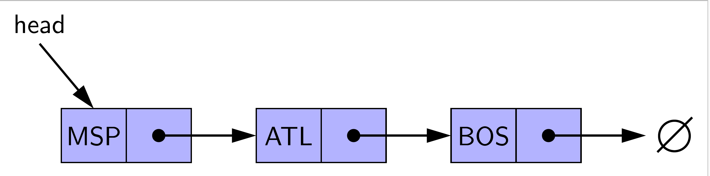

# Project 2: Singly Linked List - Recursive

**Due: Wednesday, September 21st, 10:00 pm**

_This is not a team project, do not copy someone else’s work._

Assignment Overview
-------------------
Recursion is a fundamental technique in solving problems in computer science. It allows for solving problems of arbitrary depth, and it allows for dividing problems into smaller sub-problems to make solving them easier.

There are two recursion approaches that we use in this project. Some functions will have a corresponding inner function that will be recursive, while other functions will themselves be recursive. **Every function you implement should utilize RECURSION**. In functions that utilize an inner function, this recursion will take place within the inner function. For more info on inner functions, see [here!](https://realpython.com/inner-functions-what-are-they-good-for/)

For more information on [Singly Linked Lists please Visit Zybooks Chapter 20](https://learn.zybooks.com/zybook/MSUCSE331OnsayFall2022/chapter/20/section/2)

A **Singly Linked List** **(SLL)** is a linear collection of elements, whose order is given by references stored in each element (also known as **nodes**). 
Below is a Singly Linked List with Head Reference.

This project will explore implementing a singly linked list using recursive  methods.

The Singly linked list in this project contains reference to Head and Tail.

Elements in linked lists are not stored contiguously (in one block) in memory. This enables much faster insertion and deletion (especially at the front) than is available for typical arrays and makes linked lists ideal for implementing other structures such as queues or deques (pronounced 'deck'). In some cases, large datasets may outgrow what is continuously available at a given time, making the use of standard arrays impossible.

This non-contiguous memory allocation comes with a price, however: linked lists are unable to take advantage of indexing, and elements are only accessible by traversing the list until they are found.

----------------

- In Project 2 manual points will be given based on **Run Time and Space Complexity**. Run Time and Space complexity accounts for 30% of the points on Project 2. Be sure to review the rubric and adhere to complexity requirements!
- Here is an additional information on Space Complexity [zyBooks 15.6](https://learn.zybooks.com/zybook/MSUCSE331OnsayFall2022/chapter/15/section/6)
- Space complexity includes the input data and additional memory allocated by the algorithm. An algorithm's auxiliary space complexity is the space complexity not including the input data. 
  - Ex: An algorithm to find the maximum number in a list will have a space complexity of S(N) = N + k, but an auxiliary space complexity of S(N) = k, where k is a constant.
- Please note that in our project for all our recursive methods  we will consider the recursive call stack as an auxiliary space complexity of S(n)=k, where k is a constant. Your concern for the Space complexity should be other than the call stack, whether you are using additional space.

**PARTICIPATION ACTIVITY**

* Docstrings (the multi-line comments beneath each function header) **are not provided** in Project 2. ***You must make docstrings for full credit on the project!*** Please refer to Project 1 for example on docstrings. This should include at least a one-sentence description of the function, all parameters, and what the function returns.
* Remember to work and test code locally - debugging can be especially helpful to follow along with what is happening in recursion!
* We **strongly** encourage you to avoid calling `remove` in `remove_all`. Why? It's far less efficient to repeatedly call `remove`, as each call to `remove` begins searching at the beginning of the list. In the worst case, this will lead our function to operate with O(n^2) time complexity, **violating the required time complexity.**
* A few notes on grading:
    * Time and space complexity points are **divided equally** for each function. If you fail to meet time **or** space complexity in a given function, you receive half of the manual points for that function.
    * **All of your functions must be recursive.** You will lose **all** points related to the function if it is not recursive!
        * Put more simply, ***you may not use while and for loops on this project!!!!***
    * **Do not use additional data structures**, such as lists or strings, unless specified otherwise. You will lose **all** points relating to the function if you do.
    * **Do not use global variables.** You will lose **all** points relating to the function if you do.
    * **Do not use nonlocal.** You will lose **all** points relating to the function if you do.
    * In addition to the Codio testing, you will also be graded on the **time and space** performance of your functions. Take note of the time and space complexity requirement for each function.
    * **No hardcoding testcases**. If you do this, you will lose **all** points for that function.
Assignment Specifications
-------------------------

### **class Node:**

_**Do not** **modify** this class_

* **Attributes:**
    * **value:** Value stored in a Node
    * **next:** Reference to the following Node (May be None)
* **init(self, value: T, next: Node = None) -> None:**
    * This function initializes a node with a given value and next reference, pointing to the next Node in the list.
    * self.value - the value of the Node.
    * self.next - the next Node in the list, default value is None
* **repr(self) -> str:**
    * A node is represented in string form as ‘value’.
* **str(self) -> str:**
    * A node is represented in string form as ‘value’. Use str(node) to make it a string.
* **eq(self, other: Node) -> bool:**
    * This function compares two Nodes.
    * other - the right-hand operand of the "=="
    * Returns either True or False

### **class RecursiveSinglyLinkedList:**

_**Do not modify** the following attributes/methods_

* **Attributes:**
    * **head:** The first Node in the linked list (May be None)
    * **tail:** THe last Node in the linked list (May be None)
* **init(self) -> None:**
    * This function initializes a RecursiveSinglyLinkedList
* **repr(self) -> str:**
    * A string representation of the list.
    * For this to work, you must have completed to\_string
* **eq(self, other: SLL) -> bool:**
    * This function compares two RecursiveSinglyLinkedLists.
    * other - the right-hand operand of the "=="
    * Returns either True or False

You must implement the following functions in **solution.py**. Take note of the specified return values, input parameters, and time complexity requirements. **Do not change the function signatures.**

* **push(self, value: T, back: bool = True) -> None:**
    * Insert the given **value** into the linked list    
    * The value should be inserted at the back of the list if **back** is true, otherwise it should be inserted at the front
    * NOTE: You must get this function to work in order to do the rest of the project!!!
    * Time complexity: _O(1)_
    * Space complexity: _O(1)_
    * ***This function does NOT have to be recursive***
* **to\_string(self, curr: Node) -> str:**
    * Generate and return a string representation of the list, starting at head **curr**
    * The values should be separated by a " --> " (a space followed by two hyphens, a greater than symbol, and then another space)
        * Make sure to avoid a trailing " --> "!
    * Return the string "None" if there are no nodes in the list.
    * You are allowed to use strings in this function.
    * Time complexity: _O(n)_, assuming string concatenation method is _O(1)_
    * Space complexity: _O(n)_
    * ***This function must be recursive***
* **length(self, curr: Node) -> int:**
    * Determines the number of nodes in the list, starting at head **curr**
    * If the list is empty, it has a length of 0.
    * Time complexity: _O(n)_
    * Space complexity: _O(1)_
    * ***This function must be recursive***
* **sum\_list(self, curr: Node) -> T:**
    * Calculates and returns the sum of the values in the list, assuming all values in the list are of the same type T, starting at head **curr**
    * If the list is empty, return None.
    * Note that this must work with any type T, whether T is an integer, a string, etc. How can you get the starting value of the correct type for your summation?
    * Time complexity: _O(n), assuming addition operation is O(1)_
    * Space complexity: _O(1)_
    * ***This function must be recursive***
* **search(self, value: T) -> bool:**
    * Looks for **value** in the list
    * Returns True if the value is in the list and False if it is not in the list
    * Time complexity: _O(n)_
    * Space complexity: _O(1)_
    * ***Must call helper function search_inner***
* **search_inner(curr: Node) -> bool:**
    * Looks for **value** (from search) in the list starting at head **curr**
    * Returns True if the value is in the list and False if it is not in the list
    * For more info on inner functions, see [here](https://realpython.com/inner-functions-what-are-they-good-for/)
    * Time complexity: _O(n)_
    * Space complexity: _O(1)_
    * ***This function must be recursive***
* **count(self, value: T) -> int:**
    * Counts and returns how many times the given **value** occurs in the list
    * Time complexity: _O(n)_
    * Space complexity: _O(1)_
    * ***Must call helper function count_inner***
* **count_inner(curr: Node) -> int:**
    * Counts and returns how many times the given **value** occurs in the list starting at head **curr**
    * For more info on inner functions, see [here](https://realpython.com/inner-functions-what-are-they-good-for/)
    * Time complexity: _O(n)_
    * Space complexity: _O(1)_
    * ***This function must be recursive***
* **remove(self, value: T) -> bool:**
    * Remove the first node in the list with the given **value**
    * If the value doesn’t exist, do not change the linked list
    * Returns a bool indicating if anything was successfully deleted
    * Time complexity: _O(n)_
    * Space complexity: _O(1)_
    * ***Must call helper function remove_inner***
* **remove_inner(curr: Node) -> Tuple[Node, bool]:**
    * Remove the first node in the list with the given **value**  (from remove) starting at head **curr**
    * If the value doesn’t exist, do not change the linked list
    * Returns a tuple with the head of the list and bool indicating if anything was successfully deleted
    * For more info on inner functions, see [here](https://realpython.com/inner-functions-what-are-they-good-for/)
    * Time complexity: _O(n)_
    * Space complexity: _O(1)_
    * ***This function must be recursive***
* **remove\_all(self, value: T) -> bool:**
    * Remove all nodes in the list with the given **value**
    * If the value doesn’t exist, do not change the linked list
    * Returns a bool indicating if anything was successfully deleted
    * Time complexity: _O(n)_
    * Space complexity: _O(1)_
    * ***Must call helper function remove_all_inner***
* **remove_all_inner(curr: Node) -> Tuple[Node, bool]:**
    * Remove all nodes in the list with the given **value**  (from remove_all) starting at head **curr**
    * If the value doesn’t exist, do not change the linked list
    * Returns a tuple with the head of the list and bool indicating if anything was successfully deleted
    * For more info on inner functions, see [here](https://realpython.com/inner-functions-what-are-they-good-for/)
    * Time complexity: _O(n)_
    * Space complexity: _O(1)_
    * ***This function must be recursive***

    
**Application Problem:** 
-------------------------

It's finally here! The MSU vs UofM football game. You have been waiting all semester for this and get there at the break of dawn to get into the stadium. While waiting for the announcer to call the starting lineup, your friend wants to mess around with the UofM football. He wants to reverse the order of the starting lineup so that the announcer calls the wrong player's name when a UofM player runs out onto the field. After some quick digging, you find out that the player names are all stored in a singly linked list. You have been tasked with recursively reversing the linked list before the game starts. 

Good luck Spartans! Go Green!

To do this, you will implement one function:

* **reverse(data: SLL, curr: Node) -> None:**
    * Given a singly linked list **data** starting with head **curr**, reverse the list using a recursive approach. 
    * The solution code is 8 lines; try to draw this problem out and think about how the recursive call stack can be used to your advantage to solve this problem. Once you overcome the conceptual difficulty of the problem, the code is easy!
    * You can visualize the call stack in PyCharm debugger under the [frames](https://www.jetbrains.com/help/pycharm/debug-tool-window-frames.html) panel!
    * Time complexity: _O(n)_
    * Space complexity: _O(1)_
        * Notice the space complexity - you can not create a new linked list to solve this problem!
    * ***This function must be recursive***

### **Example 1:**

data = "McNamara, Cade" --> "Wilson, Roman" --> "Bell, Ronnie"

After running the function, the SLL would now look like:

playlist = "Bell, Ronnie" --> "Wilson, Roman" --> "McNamara, Cade"

### **Example 2:**

data = "Johnson, Cornelius" --> "Corum, Blake"

After running the function, the SLL would now look like:

playlist = "Corum, Blake" --> "Johnson, Cornelius"

  

## **Submission**

#### **Deliverables**
In every project you will be given a file named as "**solution.py**". Your will work on this file to write your Python code.
We recommend that you **download your "solution.py" and "tests.py" to your local drive**, and work on your project using PyCharm so you can easily debug your code.

Below are the simple steps to work on any project locally in your personal computer in this class:

**APPROACH 1: USING D2L TO DOWNLOAD PROJECT'S STARTER PACKAGE:**
1. Make sure you installed PyCharm
2. You can download the starter package from D2L under Projects content. Watch the short tutorial video on how to download the starter package from D2L and open it up in PyCharm.
3. Work on your project as long as you want then upload your solution.py , (watch the short tutorial video on D2L for uploading your solution.py), and upload your solution.py to Codio.
4. Click Submit button on Guide when you are done!

**APPROACH 2: USING CODIO TO DOWNLOAD solution.py and tests.py**
1. On your own computer make sure to create a local folder in your local drive, name it something like **ProjectXX**, replace xx with the actual project number, in this case your folder name would be **Project01**.
2. **Download** solution.py from Codio by simply right mouse clicking on the file tree, see image below

3. **Download** tests.py from Codio by simply right mouse clicking on the file tree as shown above.
4. Work locally using PyCharm as long as you need. 
5. When finished with your solution.py file, upload your file to Codio by right mouse clicking on the Project Directory on file tree.You should rename or remove the solution.py file that is currently existing in Codio before you upload your completed version. 
6. Go To Guide and click Submit button

**It does not matter which approach you choose to work on your project, just be sure to upload your solution, “solution.py”, to Codio by and click on the Submit button by its deadline. **
Working locally is recommended so you can learn debugging. You can complete your entire solution.py using Codio editor, debugging may not as intuitive as PyCharm IDE. For this reason we recommend that you work locally as long as you need, then upload your code to Codio.

**Grading**

* **Auto Graded Tests (70 points)** see below for the point distribution for the auto graded tests:

        * to\_string: 3 points
        * length: 3 points
        * sum\_list: 4 points
        * push: 4 points
        * remove: 8 points
        * remove\_all: 8 points
        * search: 10 points
        * count: 10 points
        * **reverse( application problem )**: 20 points

* **Manual (30 points)**
  * Time and Space complexity points are **divided equally** for each function. If you fail to meet time **or** space complexity in a given function, you receive half of the manual points for that function.
  * Loss of 1 point per missing docstring (max 5 point loss)
  * Loss of 2 points per changed function signature (max 20 point loss)
  * Loss of complexity and loss of testcase points for the required functions in this project. **You may not use any additional data structures other than linked lists in this function - this includes no python lists, dictionaries, and sets!**
 
        * to\_string: __/2
        * length: __/2
        * sum\_list: __/2
        * push: __/3
        * remove: __/3
        * remove\_all: __/4
        * search: __/2
        * count: __/2
        * reverse: __/8
        * 2 pts  for feedback and citation. See text box below to complete.
* **Important reminder**
Note students can not use Chegg or similar sites, see syllabus for details, use of outside resources for the application problem is strictly forbidden, use of outside resources is limited to max of 2 functions in a project.

    * **DOCSTRING** is not provided for this project. Please use Project 1 as a template for your DOCSTRING . 
    To learn more on what is a DOCSTRING visit the following website: [What is Docstring?](https://peps.python.org/pep-0257/)
      * One point per function that misses DOCSTRING.
      * Up to 5 points of deductions

Created by Abhinay Devapatla

{RUN ALL THE TESTS|assessment}(test-262103911)
When you are done running all the test, use the Submit button below to submit your work.

{SUBMIT!|assessment}(test-3379255259)
Please note that there will be manual grading after you submit your work. Manual Grading is 30 points in this project. 

{Check It!|assessment}(grade-book-3266829715)
{Submit Answer!|assessment}(free-text-3024451938)

